# Classly: definición del proyecto

**Programación Web (IF2003) · Grupo 603 · Primer entregable**

|                           |                                                                                         |
| ------------------------- | --------------------------------------------------------------------------------------- |
| **Plataforma**            | Classly, espacio de estudio con inteligencia artificial para estudiantes universitarios |
| **Equipo**                | [Integrante 1] · [Integrante 2] · [Integrante 3] · [Integrante 4]                       |
| **Versión del documento** | 0.1 (borrador para revisión del equipo)                                                 |
| **Fecha**                 | 26 de septiembre de 2026                                                                |

Este documento es la fuente de verdad del proyecto. Cada pantalla, consulta a la base de datos y decisión de código debe poder rastrearse hasta aquí; lo que no está escrito aquí no se construye, y cualquier cambio posterior se registra con un commit y en el [historial de cambios](#historial-de-cambios).

**Cómo leer los identificadores.** Las funcionalidades se numeran `F-xx` (sección 6), los requerimientos funcionales `RF-xx` (sección 7), los no funcionales `RNF-xx` (sección 8), las reglas de negocio `RN-xx` (sección 9), las pantallas `01`–`14` (sección 11, y el mismo número en el nombre de su imagen del mockup), las historias de usuario `HU-xx` y los casos de uso `CU-xx` (sección 13). Cada tabla indica con qué otros identificadores se relaciona, para que se pueda seguir el rastro de una funcionalidad hasta su pantalla y su tabla de datos.

## Contenido

1. [Descripción general](#1-descripción-general)
2. [Problema](#2-problema)
3. [Objetivos](#3-objetivos)
4. [Stakeholders, actores y roles](#4-stakeholders-actores-y-roles)
5. [Alcance](#5-alcance)
6. [Funcionalidades](#6-funcionalidades)
7. [Requerimientos funcionales](#7-requerimientos-funcionales)
8. [Requerimientos no funcionales](#8-requerimientos-no-funcionales)
9. [Reglas de negocio](#9-reglas-de-negocio)
10. [Modelo de datos](#10-modelo-de-datos)
11. [Pantallas y flujo](#11-pantallas-y-flujo)
12. [Mockup](#12-mockup)
13. [Historias de usuario, casos de uso, restricciones y supuestos](#13-historias-de-usuario-casos-de-uso-restricciones-y-supuestos)
14. [Historial de cambios](#historial-de-cambios)
15. [Referencias](#referencias)
16. [Declaración de uso de inteligencia artificial](#declaración-de-uso-de-inteligencia-artificial)

---

## 1. Descripción general

**Classly** es una plataforma web para que un estudiante universitario tenga en un solo lugar sus clases, sus entregas y su material de estudio, y para que convierta sus apuntes en material de repaso con ayuda de inteligencia artificial (IA).

**Para quién es.** Para estudiantes de pregrado que cursan varias asignaturas al mismo tiempo, cada una con su horario, sus tareas, sus fechas de parcial y sus apuntes. La plataforma tiene además un rol de administrador, que usa el equipo para vigilar el uso de la IA (que tiene un costo por cada generación) y gestionar las cuentas.

**Contexto.** Hoy un estudiante reparte esa información entre cuadernos, notas del celular, grupos de chat, la plataforma de su universidad y aplicaciones de calendario que no se hablan entre sí. Además, la mayoría repasa releyendo sus apuntes, una estrategia que la investigación en aprendizaje muestra como menos efectiva que ponerse a prueba con preguntas (ver sección 2).

**Idea de solución.** Classly organiza todo alrededor de la **clase**:

1. El estudiante entra con su cuenta de Google y crea sus clases con nombre, descripción, ícono y horario semanal.
2. Dentro de cada clase crea **contenidos** de seis tipos, y en todos interviene la IA:
   - **Nota:** la IA corrige ortografía y gramática sin cambiar lo que el estudiante escribió.
   - **Resumen:** la IA condensa un texto largo en la longitud elegida (corto, medio o detallado).
   - **Tarea** y **recordatorio:** tienen fecha y prioridad, la IA corrige el texto y aparecen en el calendario.
   - **Quiz:** la IA genera de 3 a 10 preguntas de opción múltiple para ponerse a prueba y ver el puntaje.
   - **Diagrama:** la IA dibuja un diagrama (flujo, mapa mental, línea de tiempo, etc.) del tema.
3. A cualquier contenido le puede adjuntar imágenes, PDF o documentos de Word.
4. Encuentra todo en **Todos los contenidos** (búsqueda y filtros) y ve sus sesiones de clase y fechas de entrega en un **calendario** por día, semana o mes.

**Modelo de uso.** Hay dos planes. **Starter** es gratuito y limita la IA (20 correcciones y 5 resúmenes al mes, sin quizzes ni diagramas). **Pro** cuesta USD 12 al mes, se paga con Paddle y amplía los límites. Los límites se controlan en la base de datos y el administrador puede ajustarlos desde la plataforma sin tocar código.

**Cómo se usa, en términos generales.** Un estudiante crea "Programación Web" con su horario de lunes y miércoles, registra el taller de la semana como tarea con su fecha, pega los apuntes de clase para obtener un resumen y, antes del parcial, genera un quiz con esos apuntes y revisa en qué se equivocó. El calendario le muestra, en la misma semana, sus clases y lo que debe entregar.

**Punto de partida.** El proyecto parte de una versión inicial de Classly que ya existe en el repositorio de código (Next.js, Supabase, OpenAI y Paddle), con el flujo del estudiante y los planes funcionando [R22]. Este documento define la **versión completa** que el equipo terminará en el semestre: agrega el rol de administrador con su panel, traduce la interfaz al español y ajusta lo que se detalla en la [sección 5](#5-alcance).

## 2. Problema

**Situación actual.** Un estudiante universitario lleva a la vez varias asignaturas, y la información de cada una llega por canales distintos: el horario en un documento de la universidad, los enunciados en la plataforma del curso, los avisos en un grupo de chat, los apuntes en un cuaderno o en el celular. No hay un lugar donde vea juntas sus clases de la semana y lo que debe entregar, así que depende de su memoria o de pasar datos a mano de un lado a otro.

A eso se suma **cómo estudia**. Los hechos documentados son estos:

- En una encuesta a 177 estudiantes universitarios, el **84 %** dijo que relee sus apuntes o el libro para estudiar y el **55 %** dijo que releer es su estrategia principal. Solo el **11 %** (19 de 177) dijo que practica recordar la información y apenas el **1 %** (2 de 177) la tiene como estrategia principal [R1].
- Ponerse a prueba funciona mejor que releer. En un experimento clásico, una semana después, quienes habían estudiado un texto y luego respondido una prueba recordaban el **56 %** del contenido, contra el **42 %** de quienes solo lo habían releído [R2]. Una revisión de diez técnicas de estudio califica la práctica con preguntas y el estudio distribuido en el tiempo como de **alta utilidad**, y releer o subrayar como de **baja utilidad** [R3].
- La postergación es la norma. Se estima que entre el **80 % y el 95 %** de los estudiantes universitarios posterga sus tareas y que casi el **50 %** lo hace de forma constante y problemática [R4].

**A quién le afecta.** Principalmente al estudiante de pregrado que cursa varias materias y trabaja con plazos cortos. Indirectamente, a sus compañeros de equipo (las entregas grupales dependen de que cada uno cumpla sus fechas) y a sus profesores, que reciben entregas tardías o incompletas.

**Consecuencias.**

- **Entregas y parciales que se olvidan o se preparan a última hora**, porque las fechas están dispersas y no hay una vista semanal que las muestre junto al horario de clases.
- **Apuntes difíciles de usar para repasar**: tienen errores de escritura, están incompletos o son demasiado largos para releerlos antes de un parcial.
- **Estudio poco efectivo**: la mayoría repasa releyendo [R1] porque preparar preguntas de práctica por su cuenta toma tiempo, aunque practicar con preguntas da mejores resultados [R2][R3].
- **Tiempo perdido reorganizando información**: copiar fechas al calendario, buscar en qué cuaderno quedó un tema, rehacer resúmenes.

**Por qué las herramientas actuales no bastan.** Un calendario no guarda apuntes, una aplicación de notas no conoce las fechas de entrega ni genera preguntas, y un chat de IA genérico no conserva el contexto de cada materia ni sus fechas. El estudiante termina usando tres o cuatro herramientas y moviendo datos a mano entre ellas. Classly une esas tres necesidades (organizar, recordar y repasar) en torno a la clase.

## 3. Objetivos

### Objetivo general

Poner en funcionamiento, antes de terminar el semestre, una plataforma web en la que un estudiante universitario organice sus clases, entregas y apuntes en un solo lugar y los convierta con IA en material de repaso (resúmenes, quizzes y diagramas), con un rol de administrador que controle el uso de la IA sin modificar código.

### Objetivos específicos

Cada objetivo tiene un indicador y una forma de comprobarlo al final del semestre.

| ID   | Objetivo específico                                                    | Indicador y meta                                                                                                                                                                         | Cómo se comprueba                                                                                                                                |
| ---- | ---------------------------------------------------------------------- | ---------------------------------------------------------------------------------------------------------------------------------------------------------------------------------------- | ------------------------------------------------------------------------------------------------------------------------------------------------ |
| OE-1 | Centralizar el horario y las entregas del estudiante en un calendario. | El 100 % de las sesiones de clase y de las tareas y recordatorios con fecha aparecen en el calendario el día y la hora correctos.                                                        | Prueba con 30 eventos registrados, revisada en dos zonas horarias del navegador (UTC−5 y UTC+1).                                                 |
| OE-2 | Que registrar la información de una materia sea rápido.                | Mediana menor a 2 minutos para crear una clase con su horario y menor a 1 minuto para crear una tarea.                                                                                   | Prueba de usabilidad cronometrada con 5 estudiantes que no conocen la plataforma.                                                                |
| OE-3 | Facilitar el estudio con preguntas de práctica.                        | En el 90 % de los intentos, un quiz a partir de un apunte de hasta 1.500 palabras se genera en menos de 30 segundos, y el 100 % de sus preguntas tiene 4 opciones con una sola correcta. | 20 quizzes generados con apuntes reales; se mide el tiempo y se revisa cada pregunta.                                                            |
| OE-4 | Controlar el costo de la IA según el plan.                             | 0 generaciones por encima del límite del plan, incluso con solicitudes simultáneas.                                                                                                      | Prueba con una cuenta Starter que envía 50 solicitudes de resumen al mismo tiempo: deben guardarse como máximo las permitidas en el mes (RN-05). |
| OE-5 | Que el administrador gestione la plataforma sin tocar código.          | Un cambio de límite hecho en la pantalla 14 aplica a la siguiente generación sin despliegues ni migraciones, y el 100 % de las suspensiones y cambios de límites queda en la bitácora.   | Demostración en la sustentación y consulta de la tabla `admin_actions`.                                                                          |
| OE-6 | Proteger los datos de cada estudiante.                                 | 0 lecturas de datos de otro estudiante y 0 claves secretas en el código que llega al navegador.                                                                                          | Prueba con dos cuentas que intentan leer datos ajenos por la API (RNF-05) y búsqueda de claves en el build (RNF-07).                             |

## 4. Stakeholders, actores y roles

### Stakeholders

| Stakeholder                                                     | Interés en el proyecto                                                        | Relación con la plataforma                                                                       |
| --------------------------------------------------------------- | ----------------------------------------------------------------------------- | ------------------------------------------------------------------------------------------------ |
| Estudiantes universitarios                                      | Organizarse, no olvidar entregas y estudiar mejor en menos tiempo.            | Usuarios finales (rol Estudiante).                                                               |
| Equipo de desarrollo                                            | Construir el producto, cumplir la definición y aprobar el curso.              | Desarrolla y opera la plataforma; sus integrantes usan el rol Administrador.                     |
| Docente del curso IF2003                                        | Que la plataforma cumpla lo definido aquí y que el equipo lo pueda sustentar. | Evalúa el repositorio, el mockup y la sustentación; no tiene un rol dentro de la plataforma.     |
| Proveedores externos: Google, Supabase, OpenAI, Paddle y Vercel | Prestar identidad, base de datos, IA, pagos y alojamiento.                    | No usan la plataforma, pero su disponibilidad y sus precios afectan el servicio (ver supuestos). |

### Actores

- **Visitante:** persona sin sesión. Ve la página pública con las funciones y los planes, e inicia sesión.
- **Estudiante (rol `student`):** usuario registrado que organiza sus clases y crea contenidos. Tiene un **plan**, Starter o Pro, que define cuánta IA puede usar.
- **Administrador (rol `admin`):** integrante del equipo que consulta métricas, gestiona cuentas y define los límites de los planes.
- **Sistema:** procesos automáticos sin intervención de una persona, como el webhook de Paddle que actualiza el plan, el control de límites de IA y la creación del perfil en el primer ingreso.
- **Servicios externos:** Google (identidad), OpenAI (modelos de IA), Paddle (cobros) y Supabase (base de datos, autenticación y archivos).

### Roles y permisos

Una cuenta tiene **un solo rol**. Starter y Pro no son roles distintos sino **planes del rol Estudiante**: comparten las mismas pantallas y cambian solo los límites de IA.

| Acción                                       | Visitante | Estudiante Starter |      Estudiante Pro       | Administrador |
| -------------------------------------------- | :-------: | :----------------: | :-----------------------: | :-----------: |
| Ver la página pública y los planes           |    ✅     |         ✅         |            ✅             |      ✅       |
| Iniciar sesión con Google                    |    ✅     |         —          |             —             |       —       |
| Crear, buscar, editar y eliminar sus clases  |     —     |         ✅         |            ✅             |       —       |
| Crear notas, tareas y recordatorios con IA   |     —     |    ✅ 20 al mes    |   ✅ sin límite mensual   |       —       |
| Crear resúmenes con IA                       |     —     |    ✅ 5 al mes     |   ✅ sin límite mensual   |       —       |
| Crear y resolver quizzes                     |     —     |         —          |   ✅ sin límite mensual   |       —       |
| Crear diagramas                              |     —     |         —          |       ✅ 30 al mes        |       —       |
| Adjuntar archivos a sus contenidos           |     —     |         ✅         |            ✅             |       —       |
| Ver todos sus contenidos y su calendario     |     —     |         ✅         |            ✅             |       —       |
| Ver su plan y su uso de IA                   |     —     |         ✅         |            ✅             |       —       |
| Mejorar a Pro / administrar la suscripción   |     —     |     ✅ mejorar     | ✅ administrar o cancelar |       —       |
| Editar su perfil y cerrar sesión             |     —     |         ✅         |            ✅             |      ✅       |
| Ver métricas y la lista de usuarios          |     —     |         —          |             —             |      ✅       |
| Suspender y reactivar cuentas de estudiantes |     —     |         —          |             —             |      ✅       |
| Editar los límites de los planes             |     —     |         —          |             —             |      ✅       |
| Ver las clases o contenidos de otra persona  |     —     |         —          |             —             |   — (nadie)   |

Pro tiene además un tope de 100 generaciones de IA en cualquier periodo de 24 horas, sumando todos los tipos (RN-05).

### Cómo funciona el login

1. El visitante pulsa **Iniciar sesión** o **Empieza gratis** en la página pública (pantalla 01) y se abre la ventana de inicio de sesión (pantalla 02).
2. Pulsa **Continuar con Google**. Supabase Auth lo envía a Google, donde autoriza el acceso, y Google lo devuelve a la ruta `/auth/callback` con un código de un solo uso.
3. El servidor cambia ese código por una sesión, que se guarda en cookies. Classly **no guarda contraseñas** (RNF-04).
4. Si es el primer ingreso, el sistema crea el perfil en la tabla `users` con el nombre, el correo y la foto de Google, rol `student` y plan `starter` (RF-02, RN-01).
5. El sistema revisa el perfil. Si la cuenta está suspendida, cierra la sesión y muestra el aviso en la pantalla 02 (RF-05). Si el rol es `admin`, lo lleva al Panel (pantalla 13); si es `student`, a Mis clases (pantalla 03).
6. En cada petición, `proxy.ts` renueva la sesión y protege las rutas [R6]: sin sesión, `/app/*` y `/admin/*` redirigen a `/`; un estudiante que intente entrar a `/admin/*` vuelve a `/app/classes` (RF-04). Las acciones de servidor repiten esas verificaciones (RNF-09, RNF-18).
7. **Cerrar sesión** (pantalla 12) elimina la sesión y lleva a la página pública.

El rol de administrador no se obtiene desde la interfaz: el equipo lo asigna directamente en la base de datos (RN-02).

## 5. Alcance

### Incluye

- **Acceso:** página pública con funciones y planes; inicio de sesión con Google; creación automática del perfil; roles Estudiante y Administrador; suspensión de cuentas.
- **Clases:** crear, buscar, editar y eliminar clases con nombre, descripción, ícono y horario semanal validado.
- **Contenidos con IA:** notas, resúmenes, tareas, recordatorios, quizzes y diagramas; edición del texto, marcar como completado, eliminación y adjuntos (imágenes, PDF y Word de hasta 5 MB).
- **Consulta:** detalle de clase con filtro por tipo; Todos los contenidos con búsqueda y filtros por tipo y fecha; calendario por día, semana y mes con filtro por tipo de evento.
- **Planes y pagos:** planes Starter y Pro; límites de IA controlados en la base de datos; resumen del uso del mes; suscripción a Pro con el checkout de Paddle y administración de la suscripción en el portal de Paddle.
- **Administración:** panel con métricas y lista de usuarios; suspender y reactivar cuentas con motivo; editor de límites de los planes; bitácora de acciones administrativas.
- **Calidad:** interfaz en español, adaptable desde 360 px de ancho, desplegada en internet (Vercel).

**Ajustes sobre la versión inicial** (incluidos en el alcance):

1. Nuevo rol de administrador: columnas `role` e `is_active` en `users`, tabla `admin_actions`, pantallas 13 y 14, y una versión de Configuración para el administrador (`/admin/settings`).
2. Interfaz completa en español: textos, mensajes y fechas.
3. La ventana de inicio de sesión muestra solo "Continuar con Google"; se quitan los botones de GitHub y Facebook, que no funcionaban.
4. Se retira la página de prueba "Ask Classly AI" (`/app/dashboard`), que no está enlazada ni tiene lógica.
5. La página pública deja de anunciar funciones que no existen (reconocimiento de texto u "OCR"), no muestra testimonios inventados y lee los límites de los planes desde la base de datos.
6. El quiz enviado muestra el puntaje y su botón **Eliminar** funciona; las tarjetas de Todos los contenidos indican a qué clase pertenecen.
7. El menú de cada clase deja solo las opciones que funcionan (Editar y Eliminar); al eliminar una clase también se borran sus archivos adjuntos, y si la IA falla al crear un contenido se borran los adjuntos que ya se habían subido.
8. Se corrigen los defectos conocidos que afectan a estas funciones: la URL que se guarda de cada diagrama, la búsqueda de clases con caracteres especiales y la recarga de la lista después de crear una clase.

### No incluye

| No incluye                                                                                       | Por qué                                                       |
| ------------------------------------------------------------------------------------------------ | ------------------------------------------------------------- |
| Aplicación móvil nativa o modo sin conexión                                                      | Se cubre con la versión web adaptable (RNF-11).               |
| Registro con correo y contraseña, o con GitHub o Facebook                                        | Se decidió usar solo Google (decisión D-01).                  |
| Rol de profesor, cursos compartidos o trabajo colaborativo entre estudiantes                     | Cada estudiante trabaja con sus propios datos (RN-09).        |
| Compartir clases o contenidos con otras personas                                                 | La información de cada estudiante es privada (RN-09).         |
| Chat con la IA sobre los apuntes ("Ask Classly AI")                                              | Excede el tiempo del semestre; se retira la página de prueba. |
| Reconocimiento de texto en imágenes (OCR)                                                        | No existe en la plataforma; se quita de la publicidad.        |
| Notificaciones por correo, SMS o push                                                            | Los recordatorios se ven en la plataforma y el calendario.    |
| Integración con la plataforma de la universidad (Moodle, Google Classroom) o con Google Calendar | Requiere permisos y acuerdos externos.                        |
| Calificaciones, promedios o seguimiento académico                                                | No es el problema que se resuelve.                            |
| Otros medios de pago o planes distintos de Starter y Pro                                         | El cobro se hace solo con el checkout de Paddle.              |
| Varios idiomas o selector de idioma, modo oscuro                                                 | La interfaz es solo en español y tema claro.                  |
| Que el administrador vea o edite contenidos de los estudiantes                                   | Privacidad (RN-09, decisión D-08).                            |

## 6. Funcionalidades

Lista de lo que ofrece la plataforma, agrupada por rol. Cada funcionalidad indica los requerimientos de la sección 7 que la detallan.

**Visitante**

| ID   | Funcionalidad                                                | Requerimientos                    |
| ---- | ------------------------------------------------------------ | --------------------------------- |
| F-01 | Conocer la plataforma y los planes con sus límites vigentes. | RF-08                             |
| F-02 | Entrar con Google; la cuenta se crea en el primer ingreso.   | RF-01, RF-02, RF-03, RF-04, RF-05 |

**Estudiante (planes Starter y Pro)**

| ID   | Funcionalidad                                                                                     | Requerimientos                    |
| ---- | ------------------------------------------------------------------------------------------------- | --------------------------------- |
| F-03 | Gestionar sus clases con horario semanal: crear, buscar, editar y eliminar.                       | RF-09, RF-10, RF-11, RF-12, RF-13 |
| F-04 | Crear notas, resúmenes, tareas y recordatorios con ayuda de la IA, viendo cuántos usos le quedan. | RF-15, RF-16, RF-17, RF-20, RF-21 |
| F-05 | Adjuntar archivos a sus contenidos.                                                               | RF-22                             |
| F-06 | Consultar, editar, completar y eliminar sus contenidos.                                           | RF-14, RF-23, RF-24, RF-25, RF-26 |
| F-07 | Buscar y filtrar todos sus contenidos.                                                            | RF-28                             |
| F-08 | Ver sus clases, tareas y recordatorios en un calendario.                                          | RF-29, RF-30, RF-31               |
| F-09 | Editar su perfil y cerrar sesión (también para el administrador).                                 | RF-06, RF-07                      |
| F-10 | Consultar su plan y su uso de IA del mes.                                                         | RF-20, RF-21, RF-32               |
| F-11 | Mejorar a Pro y administrar o cancelar la suscripción.                                            | RF-33, RF-34                      |

**Estudiante Pro (además de lo anterior)**

| ID   | Funcionalidad                                            | Requerimientos |
| ---- | -------------------------------------------------------- | -------------- |
| F-12 | Generar quizzes con la IA, resolverlos y ver el puntaje. | RF-18, RF-27   |
| F-13 | Generar diagramas con la IA.                             | RF-19          |

**Administrador**

| ID   | Funcionalidad                                                            | Requerimientos |
| ---- | ------------------------------------------------------------------------ | -------------- |
| F-14 | Consultar las métricas de la plataforma.                                 | RF-35          |
| F-15 | Gestionar las cuentas de los estudiantes: buscar, suspender y reactivar. | RF-36, RF-37   |
| F-16 | Configurar los límites de IA de cada plan.                               | RF-38          |
| F-17 | Consultar la bitácora de acciones administrativas.                       | RF-39          |

## 7. Requerimientos funcionales

Prioridad: **Alta** = sin esto la plataforma no cumple su propósito; **Media** = importante, se construye después de las de prioridad alta; **Baja** = mejora la experiencia. La columna "Pantallas" usa la numeración de la sección 11.

| ID    | Requerimiento                                                                                                                                                                                                                                                     | Rol                       | Prioridad | F          | Pantallas          |
| ----- | ----------------------------------------------------------------------------------------------------------------------------------------------------------------------------------------------------------------------------------------------------------------- | ------------------------- | --------- | ---------- | ------------------ |
| RF-01 | El sistema debe permitir iniciar sesión con una cuenta de Google (OAuth 2.0) desde la página pública.                                                                                                                                                             | Visitante                 | Alta      | F-02       | 01, 02             |
| RF-02 | En el primer inicio de sesión, el sistema debe crear el perfil del usuario con el nombre, el correo y la foto de Google, con rol estudiante y plan Starter.                                                                                                       | Sistema                   | Alta      | F-02       | 02                 |
| RF-03 | Después de iniciar sesión, el sistema debe llevar al estudiante a Mis clases y al administrador al Panel de administración.                                                                                                                                       | Estudiante, Administrador | Alta      | F-02       | 02, 03, 13         |
| RF-04 | El sistema debe impedir el acceso a `/app/*` sin sesión (redirige a la página pública) y a `/admin/*` a quien no tenga rol administrador (redirige a Mis clases).                                                                                                 | Sistema                   | Alta      | F-02       | Todas las privadas |
| RF-05 | Si la cuenta está suspendida, el sistema debe cerrar la sesión y mostrar en la ventana de inicio de sesión un aviso con el canal de contacto.                                                                                                                     | Sistema                   | Alta      | F-02       | 02                 |
| RF-06 | El sistema debe permitir editar el nombre visible y la URL de la foto de perfil; el correo se muestra pero no se puede editar.                                                                                                                                    | Estudiante, Administrador | Media     | F-09       | 12                 |
| RF-07 | El sistema debe permitir cerrar sesión desde Configuración.                                                                                                                                                                                                       | Estudiante, Administrador | Alta      | F-09       | 12                 |
| RF-08 | El sistema debe mostrar una página pública con las funciones de la plataforma y los planes Starter y Pro, con su precio y los límites de IA leídos de la tabla `plan_limits`.                                                                                     | Visitante                 | Media     | F-01       | 01                 |
| RF-09 | El sistema debe permitir crear una clase con nombre, descripción, ícono (12 opciones) y un horario semanal opcional de una o más sesiones (día, hora de inicio y hora de fin).                                                                                    | Estudiante                | Alta      | F-03       | 03, 04             |
| RF-10 | Antes de guardar, el sistema debe validar que cada sesión del horario tenga inicio y fin, que el fin sea posterior al inicio y que no se cruce con otra sesión de la misma clase el mismo día, y señalar la sesión con error.                                     | Estudiante                | Alta      | F-03       | 04                 |
| RF-11 | El sistema debe listar las clases del estudiante y filtrarlas por nombre o descripción mientras escribe.                                                                                                                                                          | Estudiante                | Alta      | F-03       | 03                 |
| RF-12 | El sistema debe permitir editar los datos y el horario de una clase.                                                                                                                                                                                              | Estudiante                | Media     | F-03       | 03, 04, 05         |
| RF-13 | El sistema debe permitir eliminar una clase, previa confirmación, junto con sus contenidos y sus archivos adjuntos.                                                                                                                                               | Estudiante                | Media     | F-03       | 03, 05             |
| RF-14 | El sistema debe mostrar los contenidos de una clase, del más reciente al más antiguo, y filtrarlos por tipo.                                                                                                                                                      | Estudiante                | Alta      | F-06       | 05                 |
| RF-15 | El sistema debe permitir crear una nota: la IA corrige ortografía, gramática y puntuación del título y del texto sin cambiar palabras ni agregar información, y se guardan el texto original y el corregido.                                                      | Estudiante                | Alta      | F-04       | 06, 07             |
| RF-16 | El sistema debe permitir crear un resumen eligiendo la longitud (corto: 50–100 palabras; medio: 150–250; detallado: 300–500); la IA genera un título y el resumen con solo la información del texto y en su mismo idioma.                                         | Estudiante                | Alta      | F-04       | 06, 07             |
| RF-17 | El sistema debe permitir crear una tarea o un recordatorio con fecha y prioridad obligatorias; la IA corrige el texto como en las notas.                                                                                                                          | Estudiante                | Alta      | F-04       | 06, 07             |
| RF-18 | El sistema debe permitir crear un quiz: la IA genera entre 3 y 10 preguntas de opción múltiple, cada una con 4 opciones y una sola correcta, basadas solo en el texto.                                                                                            | Estudiante Pro            | Alta      | F-12       | 06, 07             |
| RF-19 | El sistema debe permitir crear un diagrama eligiendo uno de 8 tipos (flujo, mapa mental, organigrama, Venn, línea de tiempo, comparación, ciclo y pirámide) con instrucciones opcionales; la IA genera una imagen PNG que se guarda y se muestra en el contenido. | Estudiante Pro            | Media     | F-13       | 06, 07, 08         |
| RF-20 | Antes de crear un contenido, el sistema debe mostrar cuántos usos de IA le quedan en el mes para ese tipo y marcar con candado los tipos que su plan no incluye.                                                                                                  | Estudiante                | Alta      | F-04, F-10 | 06, 07             |
| RF-21 | El sistema debe registrar cada generación de IA y rechazarla con un mensaje claro si supera el límite del plan (mensual por tipo y, en Pro, el tope de 24 horas); si la generación falla, debe devolver el uso y no guardar el contenido ni sus adjuntos.         | Sistema                   | Alta      | F-04, F-10 | 07                 |
| RF-22 | El sistema debe permitir adjuntar archivos PNG, JPG, WEBP, GIF, PDF, DOC y DOCX de hasta 5 MB al crear un contenido o después, verlos y eliminarlos.                                                                                                              | Estudiante                | Media     | F-05       | 07, 08             |
| RF-23 | El sistema debe permitir abrir un contenido y ver su título, tipo, fecha, prioridad, texto o imagen del diagrama, y sus adjuntos.                                                                                                                                 | Estudiante                | Alta      | F-06       | 08                 |
| RF-24 | El sistema debe permitir editar el texto de un contenido y guardar los cambios.                                                                                                                                                                                   | Estudiante                | Media     | F-06       | 08                 |
| RF-25 | El sistema debe permitir marcar una tarea o un recordatorio como completado y volver a abrirlo.                                                                                                                                                                   | Estudiante                | Media     | F-06       | 08                 |
| RF-26 | El sistema debe permitir eliminar un contenido, previa confirmación, junto con sus archivos adjuntos.                                                                                                                                                             | Estudiante                | Media     | F-06       | 08, 09             |
| RF-27 | El sistema debe permitir responder un quiz pregunta por pregunta, enviarlo cuando todas tengan respuesta y ver las correctas, las incorrectas y el puntaje; un quiz enviado queda bloqueado.                                                                      | Estudiante Pro            | Alta      | F-12       | 09                 |
| RF-28 | El sistema debe listar los contenidos de todas las clases indicando la clase de cada uno, con búsqueda por texto (título y contenido), filtro por tipo, filtro por fecha de entrega y opción de limpiar los filtros.                                              | Estudiante                | Alta      | F-07       | 10                 |
| RF-29 | El sistema debe mostrar un calendario en vista de día, semana y mes con las sesiones de cada clase según su horario, y las tareas y recordatorios en su fecha de entrega.                                                                                         | Estudiante                | Alta      | F-08       | 11                 |
| RF-30 | El sistema debe permitir filtrar el calendario por clases, tareas, recordatorios o todos los eventos.                                                                                                                                                             | Estudiante                | Media     | F-08       | 11                 |
| RF-31 | El sistema debe mostrar el detalle de un evento (tipo, título, fecha y hora, descripción) al seleccionarlo en el calendario.                                                                                                                                      | Estudiante                | Baja      | F-08       | 11                 |
| RF-32 | El sistema debe mostrar en Configuración el plan actual, lo que incluye cada plan, el uso de IA del mes por tipo y la fecha en que se reinicia.                                                                                                                   | Estudiante                | Alta      | F-10       | 12                 |
| RF-33 | El sistema debe permitir mejorar a Pro con el checkout de Paddle; el plan cambia a Pro solo cuando llega el webhook firmado de Paddle que confirma la suscripción.                                                                                                | Estudiante Starter        | Alta      | F-11       | 12                 |
| RF-34 | El sistema debe permitir al estudiante Pro abrir el portal de Paddle para actualizar su medio de pago o cancelar la suscripción, y mostrar la fecha de renovación o de fin del plan.                                                                              | Estudiante Pro            | Media     | F-11       | 12                 |
| RF-35 | El sistema debe mostrar al administrador los usuarios registrados (y los nuevos del mes), los usuarios Pro, las generaciones de IA del mes por tipo y las cuentas suspendidas.                                                                                    | Administrador             | Alta      | F-14       | 13                 |
| RF-36 | El sistema debe listar los usuarios con su plan, estado, fecha de registro y generaciones del mes, con búsqueda por nombre o correo y filtros por plan y estado.                                                                                                  | Administrador             | Alta      | F-15       | 13                 |
| RF-37 | El sistema debe permitir suspender y reactivar la cuenta de un estudiante, con un motivo obligatorio.                                                                                                                                                             | Administrador             | Alta      | F-15       | 13                 |
| RF-38 | El sistema debe permitir editar, por plan y por tipo de IA, el límite mensual (un número, "sin límite" o "no incluido") y el tope de 24 horas, con un motivo obligatorio.                                                                                         | Administrador             | Alta      | F-16       | 14                 |
| RF-39 | El sistema debe registrar cada acción administrativa (quién, qué, a quién, cuándo, motivo y valores antes y después) y mostrar la actividad reciente en el panel.                                                                                                 | Sistema, Administrador    | Media     | F-17       | 13, 14             |

## 8. Requerimientos no funcionales

Cada requerimiento tiene un valor que se puede medir y la forma de medirlo.

| ID     | Categoría      | Requerimiento                                                                                                                                                                                                                      | Cómo se verifica                                                                     |
| ------ | -------------- | ---------------------------------------------------------------------------------------------------------------------------------------------------------------------------------------------------------------------------------- | ------------------------------------------------------------------------------------ |
| RNF-01 | Rendimiento    | Mis clases, Detalle de clase, Todos los contenidos y Calendario cargan en menos de 2 s en el 90 % de las cargas, con hasta 200 contenidos y una conexión de 10 Mbps.                                                               | 10 cargas por pantalla medidas con las herramientas de desarrollo de Chrome.         |
| RNF-02 | Rendimiento    | La página pública tiene un LCP de 2,5 s o menos y un puntaje de rendimiento de Lighthouse de 85 o más en escritorio [R20].                                                                                                         | Informe de Lighthouse sobre la versión desplegada.                                   |
| RNF-03 | Rendimiento    | Con textos de hasta 1.500 palabras, en el 90 % de los casos la corrección tarda 15 s o menos, el resumen y el quiz 30 s o menos, y el diagrama 60 s o menos. Mientras tanto se muestra un indicador de carga con un mensaje.       | 20 generaciones por tipo, cronometradas.                                             |
| RNF-04 | Seguridad      | Classly no guarda contraseñas: la autenticación la hace Google mediante Supabase Auth (OAuth 2.0) y la sesión viaja en cookies que se renuevan en cada petición [R7][R10].                                                         | Revisión del esquema: no existe ninguna columna de contraseña.                       |
| RNF-05 | Seguridad      | RLS está activo en el 100 % de las tablas; un estudiante solo lee y modifica sus propias filas [R8].                                                                                                                               | Prueba con dos cuentas: pedir por la API las clases de la otra devuelve 0 filas.     |
| RNF-06 | Seguridad      | Nadie puede cambiar su propio plan, rol o estado: las columnas `plan`, `role` e `is_active` no se pueden actualizar con el rol `authenticated`. El plan solo lo cambia el webhook y el estado solo las acciones del administrador. | Intento de `UPDATE` sobre esas columnas desde una sesión de estudiante: debe fallar. |
| RNF-07 | Seguridad      | Las claves secretas (clave de servicio de Supabase, OpenAI y Paddle) solo existen en el servidor: 0 apariciones en el código que se envía al navegador.                                                                            | Búsqueda de las claves en `.next/static` después de `npm run build`.                 |
| RNF-08 | Seguridad      | El webhook de Paddle rechaza con HTTP 400 el 100 % de las peticiones con firma ausente o inválida [R14].                                                                                                                           | 3 peticiones de prueba: sin firma, con firma alterada y con cuerpo modificado.       |
| RNF-09 | Seguridad      | Las rutas `/admin/*` y sus acciones de servidor comprueban el rol en el servidor, no solo ocultando botones.                                                                                                                       | Un estudiante que llama la acción "suspender" recibe un error y no cambia nada.      |
| RNF-10 | Seguridad      | Cada archivo se guarda en una carpeta con el id de su dueño, y solo ese usuario puede subirlo o borrarlo; el nombre incluye un segmento aleatorio [R9].                                                                            | Intento de borrar un archivo ajeno: la política de Storage lo rechaza.               |
| RNF-11 | Usabilidad     | La plataforma se ve y se usa bien desde 360 px de ancho, sin desplazamiento horizontal [R19].                                                                                                                                      | Revisión de las 14 pantallas en 360, 768 y 1440 px.                                  |
| RNF-12 | Usabilidad     | El 100 % de los textos de la interfaz, de los mensajes de error y de las fechas está en español.                                                                                                                                   | Recorrido de todas las pantallas y de los mensajes de error.                         |
| RNF-13 | Usabilidad     | El texto tiene un contraste de al menos 4,5:1 con su fondo (WCAG 2.2 AA, criterio 1.4.3) [R18]. El verde de la marca (#35f527) se usa solo como fondo o borde, nunca como color de texto sobre blanco (su contraste es de 1,5:1).  | Revisión con el verificador de contraste de las herramientas de desarrollo.          |
| RNF-14 | Usabilidad     | Un estudiante nuevo crea su primera clase y su primera nota en menos de 3 minutos sin ayuda.                                                                                                                                       | Prueba con 5 estudiantes: al menos 4 lo logran.                                      |
| RNF-15 | Usabilidad     | Toda acción que tarda más de 1 s muestra un indicador de carga, y todo error muestra un mensaje en español que dice qué hacer.                                                                                                     | Revisión de cada acción que llama al servidor.                                       |
| RNF-16 | Compatibilidad | La plataforma funciona en las dos últimas versiones de Chrome, Edge, Firefox y Safari de escritorio, y en Chrome para Android y Safari para iOS.                                                                                   | Recorrido de los flujos de la sección 11 en cada navegador.                          |
| RNF-17 | Mantenibilidad | El código usa TypeScript estricto, con 0 errores en `npx tsc --noEmit` y en `npm run lint` antes de fusionar cada Pull Request.                                                                                                    | Resultado de ambos comandos adjunto a cada Pull Request.                             |
| RNF-18 | Mantenibilidad | El 100 % de las acciones de servidor verifica la sesión, y el rol cuando aplica, antes de consultar la base de datos.                                                                                                              | Revisión de código en cada Pull Request.                                             |
| RNF-19 | Mantenibilidad | Todo cambio de esquema se hace con una migración con nombre y se registra en el historial de cambios de este documento.                                                                                                            | Lista de migraciones de Supabase comparada con el historial.                         |
| RNF-20 | Disponibilidad | La plataforma desplegada en Vercel tiene una disponibilidad mensual de al menos 99 %.                                                                                                                                              | Monitor externo que consulta la página pública cada 5 minutos.                       |
| RNF-21 | Disponibilidad | Si la IA falla o tarda más de 90 s, no queda ningún contenido a medias: 0 contenidos sin resultado de IA y el uso devuelto.                                                                                                        | Prueba simulando un error de la API de OpenAI.                                       |

## 9. Reglas de negocio

- **RN-01.** Toda cuenta nueva empieza con rol estudiante y plan Starter. Nadie se registra como administrador.
- **RN-02.** El rol de administrador solo lo asigna el equipo, directamente en la base de datos. Una cuenta tiene un único rol.
- **RN-03.** El plan de un estudiante se deriva de su suscripción en Paddle. Es Pro mientras la suscripción esté activa, en prueba o con un pago pendiente (`active`, `trialing` o `past_due`); en cualquier otro estado es Starter. Nadie, tampoco el administrador, cambia el plan a mano [R16].
- **RN-04.** Pro cuesta USD 12 al mes. Si el estudiante cancela, conserva Pro hasta el final del periodo pagado y luego pasa a Starter sin perder sus datos.
- **RN-05.** Límites de IA vigentes al iniciar el proyecto:
  - **Starter:** 20 ayudas de escritura al mes (notas, tareas y recordatorios) y 5 resúmenes al mes. Quizzes y diagramas no incluidos.
  - **Pro:** ayudas de escritura, resúmenes y quizzes sin límite mensual; 30 diagramas al mes; máximo 100 generaciones en cualquier periodo de 24 horas, sumando todos los tipos.
- **RN-06.** Los límites mensuales se cuentan por mes calendario (en hora UTC) y se reinician el día 1.
- **RN-07.** Crear un contenido consume exactamente un uso de IA de su tipo: nota, tarea y recordatorio usan "ayuda de escritura"; resumen, quiz y diagrama usan el suyo. Si la generación falla, el uso se devuelve (dentro de los 15 minutos siguientes). Editar un contenido ya creado no consume usos.
- **RN-08.** En los límites, **0** significa "no incluido en el plan" y **vacío** significa "sin límite". Un cambio de límite aplica desde la siguiente generación y no borra lo ya consumido en el mes.
- **RN-09.** Las clases, los contenidos y los adjuntos de un estudiante son privados: solo él puede verlos o modificarlos. El administrador ve datos de la cuenta y cifras de uso, nunca el contenido.
- **RN-10.** Todo contenido pertenece a una sola clase. Al eliminar una clase se eliminan sus contenidos y sus adjuntos.
- **RN-11.** Las tareas y los recordatorios requieren fecha de entrega (un día del calendario, sin hora) y prioridad (baja, media o alta). Solo ellos se pueden marcar como completados y aparecen en el calendario.
- **RN-12.** Una sesión del horario debe terminar después de empezar y no puede cruzarse con otra sesión **de la misma clase** el mismo día. Sesiones de clases distintas sí pueden cruzarse: el estudiante decide cómo organiza su horario.
- **RN-13.** La IA trabaja solo con lo que escribió el estudiante: no agrega información externa y responde en el idioma del texto. La corrección de notas no cambia palabras ni su orden.
- **RN-14.** Un quiz tiene entre 3 y 10 preguntas, cada una con 4 opciones y una sola correcta. Solo se puede enviar cuando todas las preguntas tienen respuesta; una vez enviado queda bloqueado con su puntaje.
- **RN-15.** Solo se aceptan adjuntos PNG, JPG, WEBP, GIF, PDF, DOC y DOCX, de hasta 5 MB por archivo y 5 MB por envío.
- **RN-16.** Un administrador no puede suspender a otro administrador ni a sí mismo. Suspender o reactivar exige un motivo, que queda en la bitácora.
- **RN-17.** Una cuenta suspendida no puede entrar al área privada ni generar contenido con IA. Sus datos se conservan y vuelven a estar disponibles al reactivarla.
- **RN-18.** La página pública solo anuncia funciones que existen y muestra los límites vigentes; no se publican testimonios inventados.

## 10. Modelo de datos

La información se guarda en **PostgreSQL de Supabase**; los archivos van en **Supabase Storage** y la identidad la administra **Supabase Auth**. Todas las tablas tienen seguridad por filas (RLS) [R8].

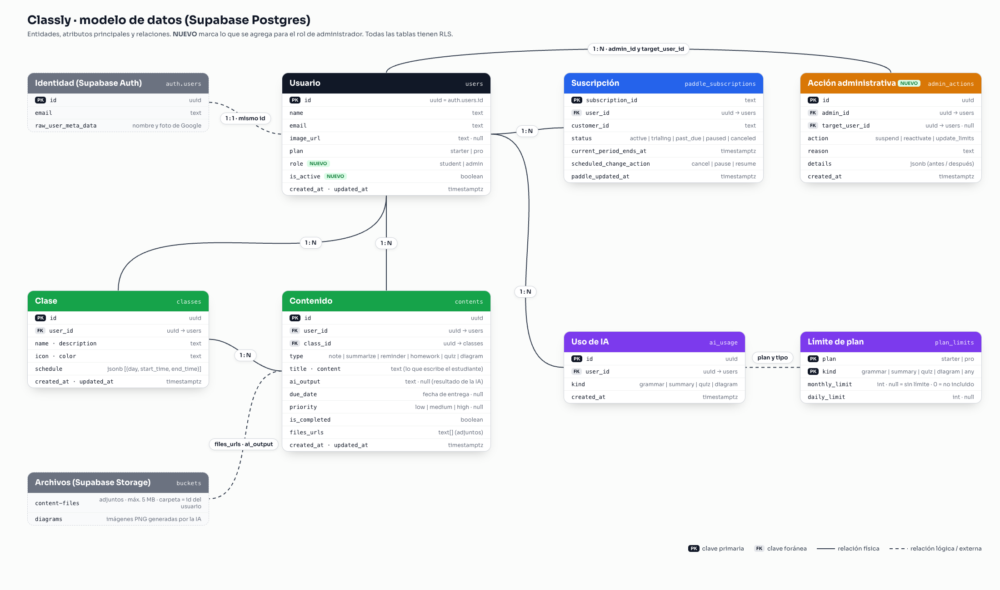

### Entidades y atributos principales

| Entidad (tabla)                                   | Atributos principales                                                                                                                                                                                                           | Para qué sirve                                                                                       |
| ------------------------------------------------- | ------------------------------------------------------------------------------------------------------------------------------------------------------------------------------------------------------------------------------- | ---------------------------------------------------------------------------------------------------- |
| Usuario (`users`)                                 | `id` (el mismo de Supabase Auth), `name`, `email`, `image_url`, `plan` (starter o pro), `role` (student o admin) **nuevo**, `is_active` **nuevo**, `created_at`, `updated_at`                                                   | Perfil, plan, rol y estado de cada cuenta.                                                           |
| Clase (`classes`)                                 | `id`, `user_id`, `name`, `description`, `icon`, `color`, `schedule` (JSON con las sesiones: día, hora de inicio y de fin), `created_at`, `updated_at`                                                                           | Materias del estudiante y su horario semanal.                                                        |
| Contenido (`contents`)                            | `id`, `user_id`, `class_id`, `type`, `title`, `content` (lo que escribió el estudiante), `ai_output` (resultado de la IA), `due_date`, `priority`, `is_completed`, `files_urls` (lista de adjuntos), `created_at`, `updated_at` | Notas, resúmenes, tareas, recordatorios, quizzes (preguntas en JSON) y diagramas (URL de la imagen). |
| Suscripción (`paddle_subscriptions`)              | `subscription_id`, `user_id`, `customer_id`, `status`, `price_id`, `current_period_ends_at`, `scheduled_change_action`, `scheduled_change_at`, `paddle_updated_at`                                                              | Copia local de la suscripción de Paddle; la escribe solo el webhook.                                 |
| Límite de plan (`plan_limits`)                    | `plan`, `kind` (grammar, summary, quiz, diagram o any), `monthly_limit`, `daily_limit`                                                                                                                                          | Cuánta IA incluye cada plan; la edita el administrador.                                              |
| Uso de IA (`ai_usage`)                            | `id`, `user_id`, `kind`, `created_at`                                                                                                                                                                                           | Una fila por cada generación de IA, para contar el uso frente al límite.                             |
| Acción administrativa (`admin_actions`) **nueva** | `id`, `admin_id`, `target_user_id`, `action` (suspend, reactivate o update_limits), `reason`, `details` (valores antes y después), `created_at`                                                                                 | Bitácora de lo que hacen los administradores.                                                        |
| Archivos (Storage)                                | Bucket `content-files` (adjuntos, carpeta = id del usuario) y bucket `diagrams` (imágenes generadas)                                                                                                                            | Guardar los archivos; en las tablas solo se guarda su URL.                                           |

### Relaciones

- Un **usuario** tiene muchas **clases**, muchos **contenidos**, muchas **suscripciones** y muchos registros de **uso de IA**. Cada uno de esos registros pertenece a un solo usuario.
- Una **clase** tiene muchos **contenidos**; cada contenido pertenece a una sola clase (RN-10). Si se borra la clase, se borran sus contenidos (borrado en cascada).
- Un **administrador** (usuario con rol admin) registra muchas **acciones administrativas**, y un **usuario** puede ser el afectado de muchas de ellas (`admin_id` y `target_user_id`).
- **Límite de plan** se relaciona de forma lógica con el usuario (por su `plan`) y con el uso de IA (por `kind`): la función `consume_ai_credit` cruza los tres para decidir si una generación se permite.
- Cada **usuario** corresponde a un registro de Supabase Auth con el mismo `id` (relación uno a uno).
- Un **contenido** referencia archivos de Storage mediante `files_urls` (adjuntos) y, en los diagramas, `ai_output` (la imagen).

### Cambios al esquema que exige esta definición

| Migración                        | Cambio                                                                                                                                                                                                                        | Sostiene                                 |
| -------------------------------- | ----------------------------------------------------------------------------------------------------------------------------------------------------------------------------------------------------------------------------- | ---------------------------------------- |
| `add_user_role_and_status`       | Agrega `users.role` (texto, por defecto `student`, valores `student` o `admin`) y `users.is_active` (booleano, por defecto `true`). Ninguna de las dos se puede actualizar desde el rol `authenticated`.                      | RF-03, RF-04, RF-05, RF-37, RN-02, RN-17 |
| `create_admin_actions`           | Crea la tabla `admin_actions` con RLS: solo los administradores pueden leerla, y se escribe desde funciones de base de datos.                                                                                                 | RF-37, RF-38, RF-39                      |
| `admin_functions`                | Funciones que comprueban el rol: `admin_set_user_active(user_id, active, reason)`, `admin_update_plan_limit(plan, kind, monthly, daily, reason)` y `admin_platform_metrics()`, que devuelve cifras agregadas y no contenidos. | RF-35 a RF-39, RN-09, RN-16              |
| `consume_ai_credit_active_check` | `consume_ai_credit` rechaza a las cuentas suspendidas.                                                                                                                                                                        | RN-17                                    |
| `drop_contents_status`           | Elimina la columna `contents.status`, que no se usa.                                                                                                                                                                          | Mantenibilidad (RNF-19)                  |

### Lógica que vive en la base de datos

- `consume_ai_credit(kind)`: toma un bloqueo por usuario, revisa el plan, los límites y el uso del mes o de las últimas 24 horas, y registra el uso **antes** de llamar a la IA. `refund_ai_credit(id)` lo devuelve si la generación falla (RF-21, RN-07, [R17]).
- `append_content_files` y `remove_content_files`: agregan y quitan adjuntos de la lista de un contenido de forma atómica (RF-22).
- `upsert_paddle_subscription` y el disparador `sync_user_plan_from_paddle`: guardan la suscripción que envía el webhook y recalculan `users.plan` (RF-33, RN-03).

### Cómo el modelo sostiene cada funcionalidad

| Funcionalidad                      | Tablas y columnas que la sostienen                                                     |
| ---------------------------------- | -------------------------------------------------------------------------------------- |
| F-01 Página pública con planes     | `plan_limits`                                                                          |
| F-02 Acceso con Google y roles     | Supabase Auth, `users` (`role`, `is_active`, `plan`)                                   |
| F-03 Clases con horario            | `classes` (`schedule`)                                                                 |
| F-04 Contenidos con IA             | `contents` (`content`, `ai_output`, `due_date`, `priority`), `ai_usage`, `plan_limits` |
| F-05 Adjuntos                      | `contents.files_urls`, bucket `content-files`                                          |
| F-06 Consultar, editar y completar | `contents` (`is_completed`, `ai_output`)                                               |
| F-07 Todos los contenidos          | `contents` y `classes` (nombre de la clase)                                            |
| F-08 Calendario                    | `classes.schedule` y `contents.due_date`                                               |
| F-09 Perfil y sesión               | `users` (`name`, `image_url`)                                                          |
| F-10 Plan y uso de IA              | `users.plan`, `ai_usage`, `plan_limits`                                                |
| F-11 Suscripción Pro               | `paddle_subscriptions`, `users.plan`                                                   |
| F-12 Quizzes                       | `contents` (`ai_output` con las preguntas y respuestas, `is_completed`)                |
| F-13 Diagramas                     | `contents.ai_output` (URL de la imagen), bucket `diagrams`                             |
| F-14 Métricas                      | `users`, `ai_usage`, `paddle_subscriptions` (solo conteos)                             |
| F-15 Gestión de cuentas            | `users` (`is_active`), `admin_actions`                                                 |
| F-16 Límites de planes             | `plan_limits`, `admin_actions`                                                         |
| F-17 Bitácora                      | `admin_actions`                                                                        |

## 11. Pantallas y flujo

La plataforma tiene 14 pantallas distintas en propósito. Las que aparecen como "ventana" se abren como ventanas modales sobre otra pantalla. La imagen de cada una está en la [sección 12](#12-mockup).

| #   | Pantalla                    | Ruta                                                                                  | Rol                             | Para qué sirve                                                                                           | Requerimientos                    |
| --- | --------------------------- | ------------------------------------------------------------------------------------- | ------------------------------- | -------------------------------------------------------------------------------------------------------- | --------------------------------- |
| 01  | Página de inicio            | `/`                                                                                   | Visitante (y cualquier persona) | Presentar las funciones y los planes con sus límites, y llevar al inicio de sesión.                      | RF-01, RF-08                      |
| 02  | Inicio de sesión            | Ventana sobre `/`                                                                     | Visitante                       | Entrar con Google; muestra el aviso si la cuenta está suspendida.                                        | RF-01, RF-02, RF-03, RF-05        |
| 03  | Mis clases                  | `/app/classes`                                                                        | Estudiante                      | Ver, buscar, crear, editar y eliminar clases; es la pantalla de llegada del estudiante.                  | RF-03, RF-09, RF-11, RF-12, RF-13 |
| 04  | Crear o editar clase        | Ventana sobre 03 o 05                                                                 | Estudiante                      | Escribir nombre y descripción, elegir el ícono y definir el horario semanal validado.                    | RF-09, RF-10, RF-12               |
| 05  | Detalle de clase            | `/app/class/[id]`                                                                     | Estudiante                      | Ver los contenidos de una clase y filtrarlos por tipo; abrir "Nuevo".                                    | RF-12, RF-13, RF-14               |
| 06  | Nuevo contenido: tipo       | Ventana sobre 05                                                                      | Estudiante                      | Elegir el tipo de contenido; los no incluidos en el plan aparecen con candado.                           | RF-15 a RF-20                     |
| 07  | Nuevo contenido: formulario | Ventana sobre 05                                                                      | Estudiante                      | Llenar los campos del tipo, adjuntar archivos y ver los usos de IA restantes.                            | RF-15 a RF-22                     |
| 08  | Ver o editar contenido      | Ventana sobre 05 o 10                                                                 | Estudiante                      | Leer el contenido o el diagrama, editar el texto, gestionar adjuntos, completar o eliminar.              | RF-19, RF-22 a RF-26              |
| 09  | Resolver quiz               | Ventana sobre 05 o 10                                                                 | Estudiante Pro                  | Responder las preguntas, enviarlas y ver el puntaje y las respuestas correctas.                          | RF-26, RF-27                      |
| 10  | Todos los contenidos        | `/app/contents`                                                                       | Estudiante                      | Buscar y filtrar los contenidos de todas las clases.                                                     | RF-28                             |
| 11  | Calendario                  | `/app/calendar`                                                                       | Estudiante                      | Ver clases, tareas y recordatorios por día, semana o mes, y el detalle de cada evento.                   | RF-29, RF-30, RF-31               |
| 12  | Configuración               | `/app/settings` (estudiante) y `/admin/settings` (administrador, sin la sección Plan) | Estudiante, Administrador       | Editar el perfil; ver el plan y el uso de IA; mejorar a Pro o administrar la suscripción; cerrar sesión. | RF-06, RF-07, RF-32, RF-33, RF-34 |
| 13  | Panel de administración     | `/admin`                                                                              | Administrador                   | Ver métricas, buscar usuarios, suspender o reactivar cuentas y ver la actividad reciente.                | RF-03, RF-35, RF-36, RF-37, RF-39 |
| 14  | Límites de planes           | `/admin/limits`                                                                       | Administrador                   | Editar los límites de IA de cada plan con un motivo.                                                     | RF-38, RF-39                      |

El checkout de Paddle no es una pantalla de Classly: es una ventana de Paddle que se abre sobre Configuración (12) y en la que Classly no ve los datos de la tarjeta.

### Navegación permanente

- **Barra lateral del estudiante:** Clases (03) · Contenidos (10) · Calendario (11) · Configuración (12).
- **Barra lateral del administrador:** Panel (13) · Límites de planes (14) · Configuración (12).
- Las ventanas (02, 04, 06, 07, 08 y 09) vuelven a la pantalla desde la que se abrieron al cerrarse.

### Flujo de cada rol

- **Visitante:** Página de inicio (01) → Inicio de sesión (02) → Google → Mis clases (03) si es estudiante, o Panel (13) si es administrador.
- **Estudiante Starter:** Mis clases (03) → Crear clase con horario (04) → Detalle de clase (05) → Nuevo contenido: tipo (06) → formulario de tarea (07) → vuelve a 05 con la nueva tarjeta → Calendario (11), donde aparecen la tarea y las sesiones → Configuración (12): ve su uso de IA → Mejorar a Pro → checkout de Paddle → Configuración con plan Pro.
- **Estudiante Pro:** Detalle de clase (05) → Nuevo contenido: tipo Quiz (06) → formulario (07) → Resolver quiz (09) y ver el puntaje → Todos los contenidos (10): busca "HTTP" → Ver o editar contenido (08): corrige el texto o marca una tarea como completada.
- **Administrador:** Inicio de sesión (02) → Panel (13): revisa métricas, busca un usuario y lo suspende con un motivo → Límites de planes (14): cambia un límite con un motivo → Panel (13): ve ambas acciones en la actividad reciente → Configuración (12) → cerrar sesión.

El siguiente diagrama está escrito en Mermaid, que GitHub muestra como imagen [R21]; la versión con miniaturas de cada pantalla está en la sección 12.

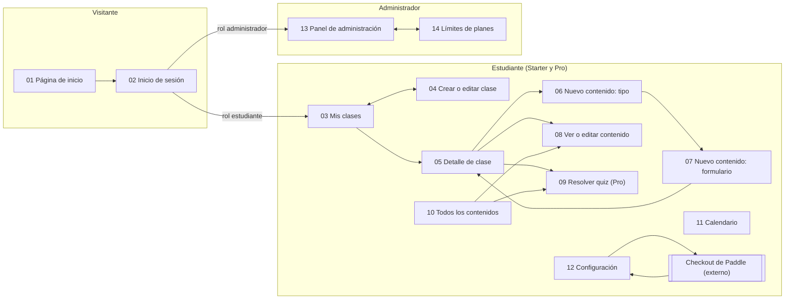
```mermaid
flowchart LR
  subgraph V["Visitante"]
    P01["01 Página de inicio"] --> P02["02 Inicio de sesión"]
  end
  P02 -->|"rol estudiante"| P03
  P02 -->|"rol administrador"| P13
  subgraph E["Estudiante (Starter y Pro)"]
    P03["03 Mis clases"] <--> P04["04 Crear o editar clase"]
    P03 --> P05["05 Detalle de clase"]
    P05 --> P06["06 Nuevo contenido: tipo"] --> P07["07 Nuevo contenido: formulario"] --> P05
    P05 --> P08["08 Ver o editar contenido"]
    P05 --> P09["09 Resolver quiz (Pro)"]
    P10["10 Todos los contenidos"] --> P08
    P10 --> P09
    P11["11 Calendario"]
    P12["12 Configuración"] --> PAD[["Checkout de Paddle (externo)"]] --> P12
  end
  subgraph A["Administrador"]
    P13["13 Panel de administración"] <--> P14["14 Límites de planes"]
  end
```

## 12. Mockup

**Herramienta.** El mockup se construyó como páginas HTML y CSS que reproducen el sistema de diseño real de Classly (fuente Sora, verde de la marca #35f527, tarjetas, insignias y ventanas de la versión inicial) y se exportó a PNG con Chrome en modo automático. Las fuentes están en [`docs/mockup/fuente/`](mockup/fuente/), así que cualquier cambio al mockup se hace con un commit. **Todos los nombres, correos y cifras que aparecen son ficticios.** Se usan tres personas de ejemplo: **Valentina** (estudiante Pro), **Mateo** (estudiante Starter) y **Camila** (administradora).

### Recorrido entre pantallas

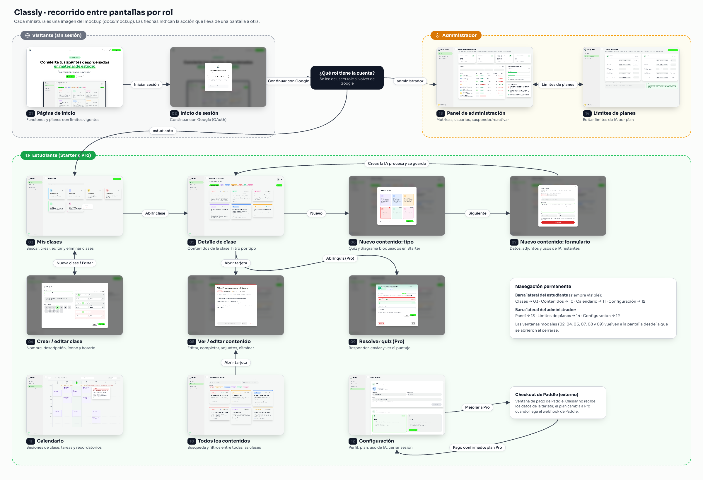

`docs/mockup/00-recorrido.png`: todas las pantallas en miniatura, agrupadas por rol, con flechas que indican la acción que lleva de una a otra. Resume los flujos de la sección 11 en una sola imagen.

### Pantallas

**01 · Página de inicio** (`docs/mockup/01-inicio.png`)

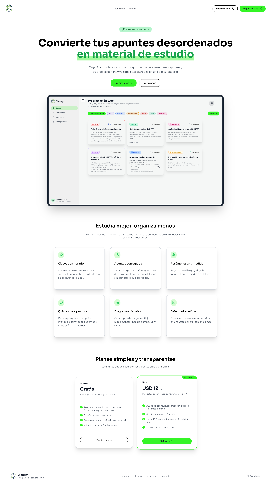

Encabezado con **Iniciar sesión** y **Empieza gratis**, un mensaje principal con una captura de la plataforma, seis tarjetas con las funciones y los dos planes con precio y límites leídos de la base de datos. No hay testimonios inventados ni funciones que no existen (RN-18). Requerimientos: RF-01, RF-08.

**02 · Inicio de sesión** (`docs/mockup/02-inicio-sesion.png`)

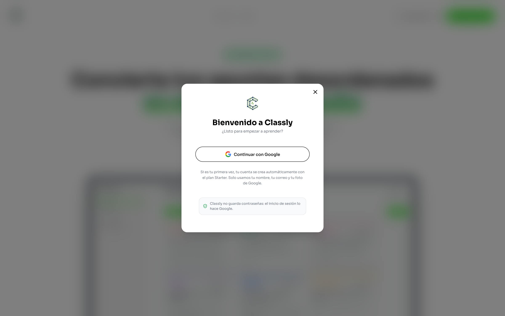

Ventana centrada sobre la página de inicio con un único botón, **Continuar con Google**. Explica que la cuenta se crea sola con el plan Starter y que Classly no guarda contraseñas. Si la cuenta está suspendida, en este mismo lugar aparece el aviso (RF-05). Requerimientos: RF-01, RF-02, RF-03, RF-05.

**03 · Mis clases** (`docs/mockup/03-mis-clases.png`)

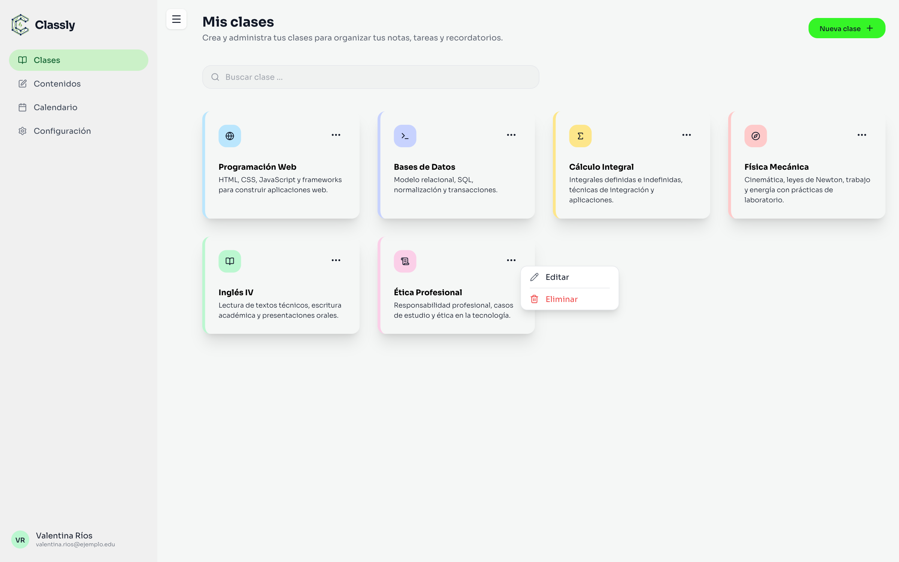

Cuadrícula con las clases de Valentina: cada tarjeta tiene el ícono, el color, el nombre y la descripción. Arriba están el buscador y el botón **Nueva clase**; el menú (⋯) de una tarjeta aparece abierto con **Editar** y **Eliminar**. Requerimientos: RF-09, RF-11, RF-12, RF-13.

**04 · Crear o editar clase** (`docs/mockup/04-crear-clase.png`)

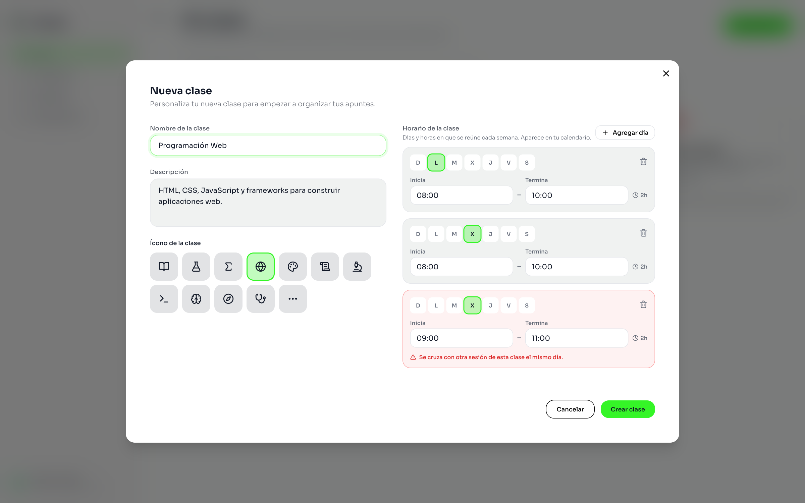

A la izquierda, el nombre, la descripción y los 12 íconos; a la derecha, el horario semanal con una tarjeta por sesión (día, hora de inicio y de fin, duración). La tercera sesión muestra el error de validación porque se cruza con otra del mismo día (RN-12). Requerimientos: RF-09, RF-10, RF-12.

**05 · Detalle de clase** (`docs/mockup/05-detalle-clase.png`)

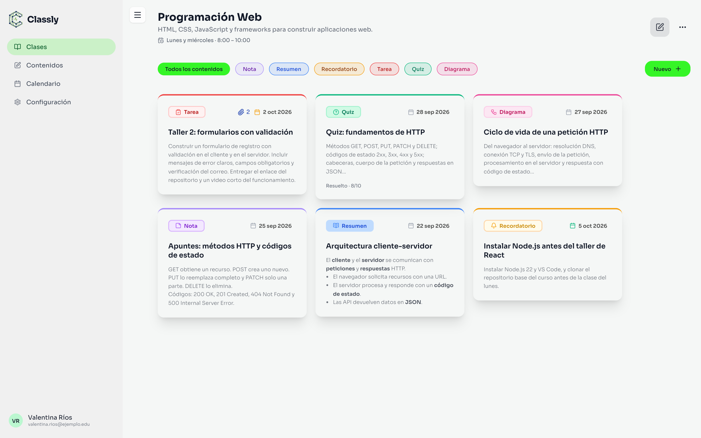

Clase "Programación Web" con su horario bajo la descripción, las píldoras para filtrar por tipo y el botón **Nuevo**. Cada tarjeta muestra el tipo, la fecha, los adjuntos y un avance del texto o del resultado de la IA. Requerimientos: RF-12, RF-13, RF-14.

**06 · Nuevo contenido: tipo** (`docs/mockup/06-nuevo-contenido-tipo.png`)

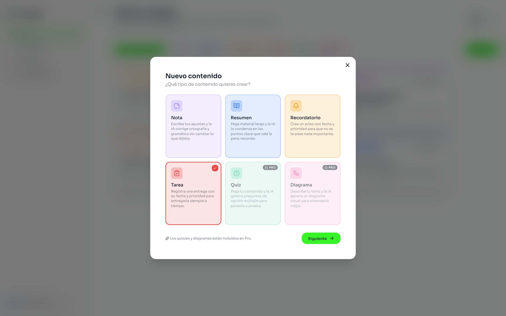

Vista de Mateo, que tiene el plan Starter: los seis tipos con su descripción; **Quiz** y **Diagrama** aparecen con candado "PRO" y un aviso abajo. Está seleccionado **Tarea** y el botón **Siguiente** lleva al formulario. Requerimientos: RF-15 a RF-20.

**07 · Nuevo contenido: formulario** (`docs/mockup/07-nuevo-contenido-formulario.png`)

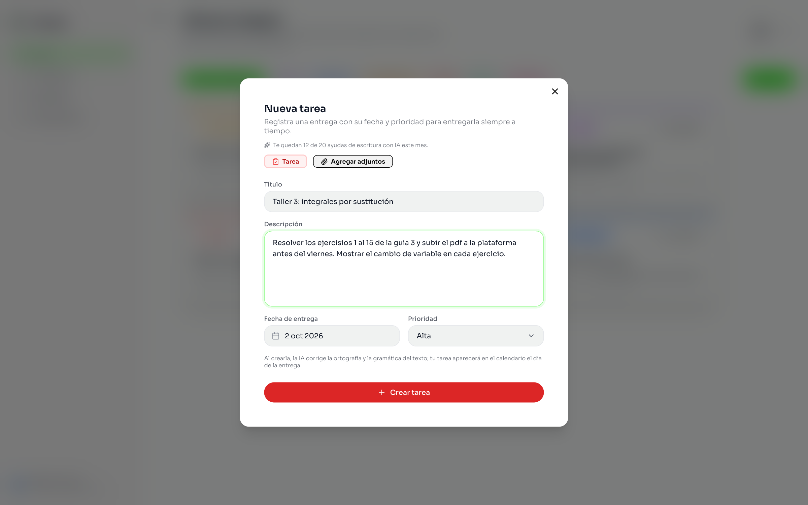

Formulario de una tarea: el aviso "Te quedan 12 de 20 ayudas de escritura", el título, una descripción con errores de ortografía que la IA corregirá, la fecha de entrega, la prioridad y la pestaña **Agregar adjuntos**. El botón toma el color del tipo. Requerimientos: RF-15 a RF-22.

**08 · Ver o editar contenido** (`docs/mockup/08-ver-contenido.png`)

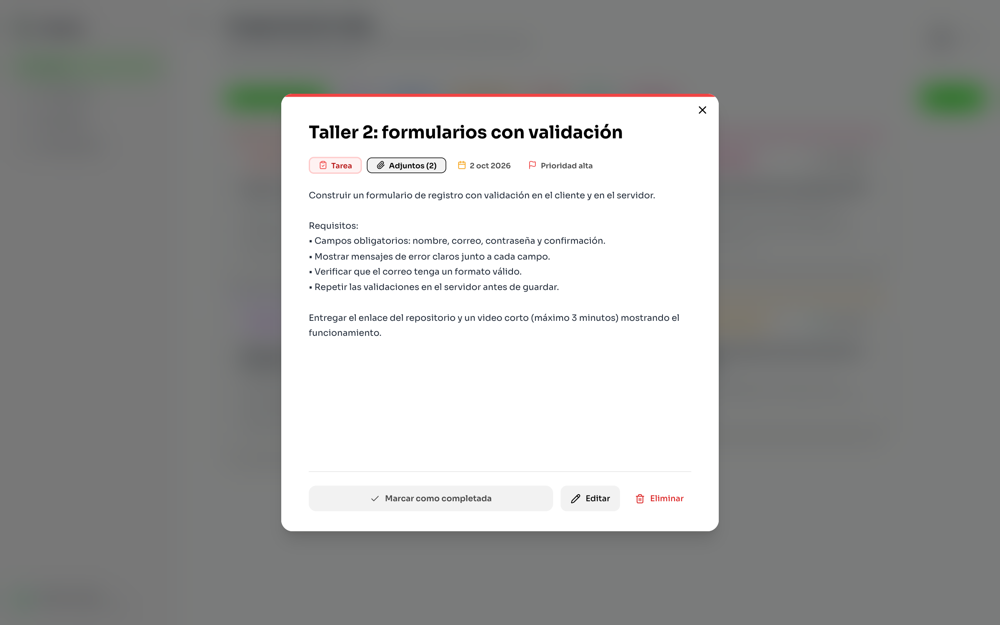

Tarea abierta con su título, insignias (tipo, adjuntos, fecha y prioridad) y el texto ya corregido por la IA. Abajo están **Marcar como completada**, **Editar** y **Eliminar**; en la pestaña de adjuntos se agregan o se quitan archivos. Requerimientos: RF-19, RF-22 a RF-26.

**09 · Resolver quiz** (`docs/mockup/09-quiz.png`)

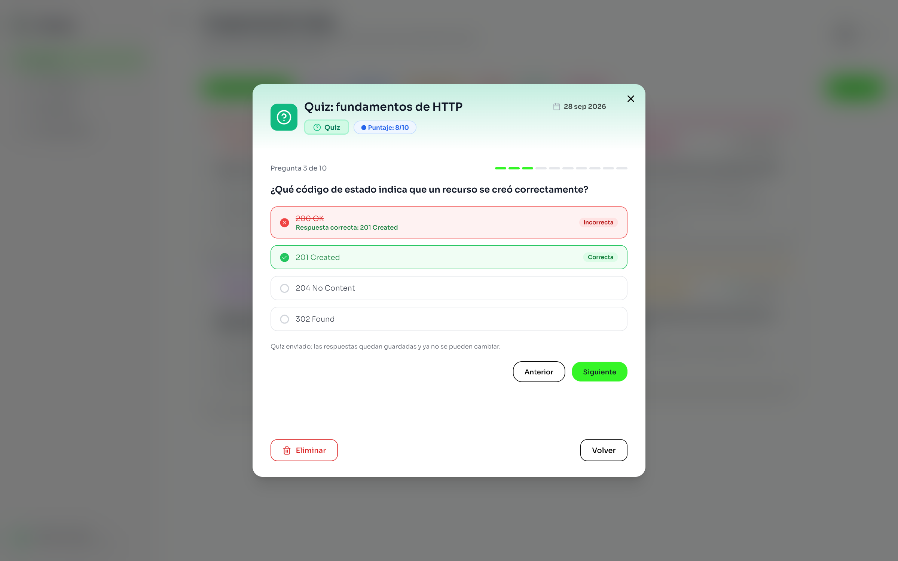

Quiz ya enviado, en la pregunta 3 de 10: la opción elegida aparece tachada como incorrecta, se indica la respuesta correcta y el encabezado muestra el puntaje 8/10. Una barra muestra el avance; el quiz queda bloqueado (RN-14). Requerimientos: RF-26, RF-27.

**10 · Todos los contenidos** (`docs/mockup/10-todos-los-contenidos.png`)

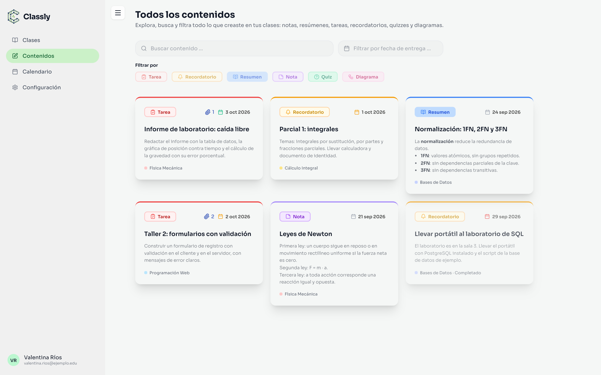

Buscador, filtro por fecha de entrega e insignias para filtrar por tipo. Las tarjetas mezclan contenidos de varias clases e indican a cuál pertenece cada una; el recordatorio completado se ve atenuado. Requerimientos: RF-28.

**11 · Calendario** (`docs/mockup/11-calendario.png`)

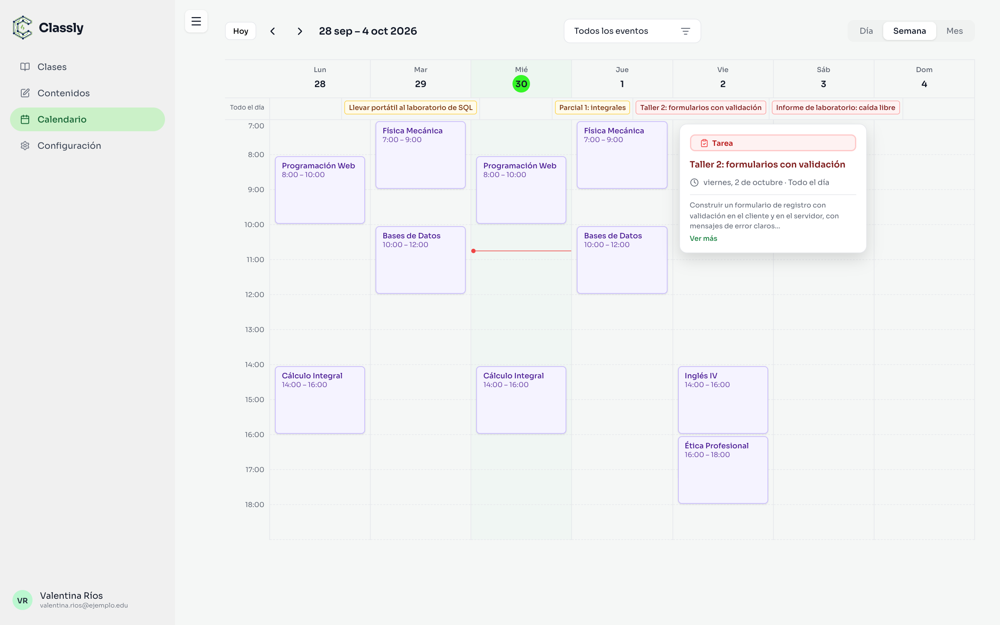

Vista semanal con las sesiones de cada clase según su horario, la fila "Todo el día" con las tareas (rojo) y los recordatorios (amarillo), la línea de la hora actual y el detalle abierto de una tarea. Arriba están el filtro por tipo de evento y las vistas Día, Semana y Mes. Requerimientos: RF-29, RF-30, RF-31.

**12 · Configuración** (`docs/mockup/12-configuracion.png`)

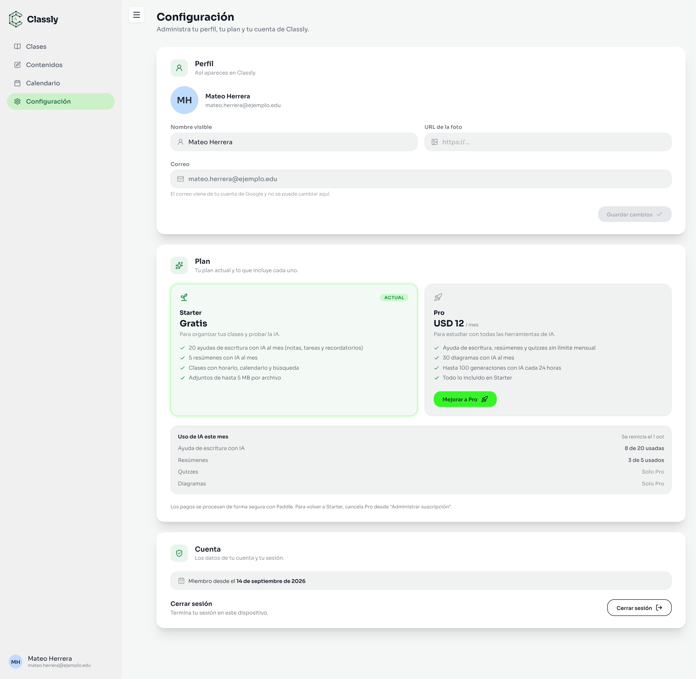

Vista de Mateo (Starter): el perfil con el correo no editable, las tarjetas de los planes con **Mejorar a Pro**, el uso de IA del mes con la fecha de reinicio y la sección Cuenta con **Cerrar sesión**. En la versión del administrador no aparece la sección Plan. Requerimientos: RF-06, RF-07, RF-32, RF-33, RF-34.

**13 · Panel de administración** (`docs/mockup/13-panel-administracion.png`)

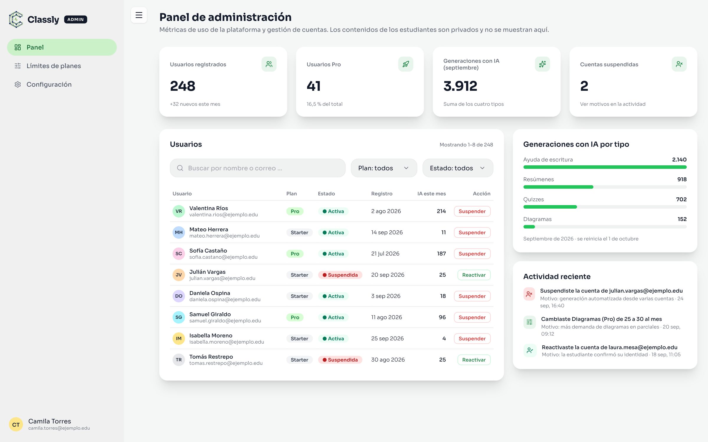

Cuatro indicadores (usuarios, usuarios Pro, generaciones del mes y cuentas suspendidas), la tabla de usuarios con búsqueda, filtros y los botones **Suspender** o **Reactivar**, las generaciones por tipo y la actividad reciente con su motivo. No muestra contenidos de los estudiantes (RN-09). Requerimientos: RF-03, RF-35, RF-36, RF-37, RF-39.

**14 · Límites de planes** (`docs/mockup/14-limites-planes.png`)

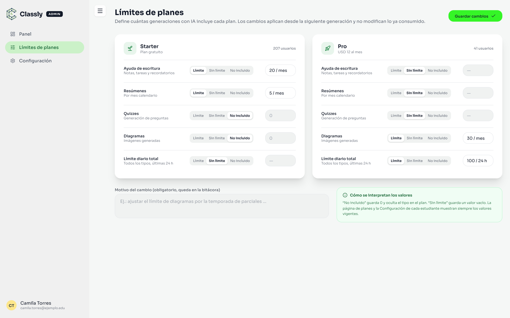

Una tarjeta por plan con una fila por tipo de IA: un selector ("Límite", "Sin límite" o "No incluido") y el valor. Abajo, el motivo obligatorio del cambio y una nota que explica cómo se interpretan los valores (RN-08). Requerimientos: RF-38, RF-39.

### Recorrido de cada rol en el mockup

- **Visitante:** 01 → 02.
- **Estudiante Starter (Mateo):** 02 → 03 → 04 → 05 → 06 → 07 → 11 → 12, donde encuentra la opción de mejorar a Pro.
- **Estudiante Pro (Valentina):** 03 → 05 → 06 → 07 → 09 → 10 → 08.
- **Administradora (Camila):** 02 → 13 → 14 → 13 → 12.

## 13. Historias de usuario, casos de uso, restricciones y supuestos

### Historias de usuario

| ID    | Historia                                                                                                                                      | Criterios de aceptación                                                                                                                                 | RF                         |
| ----- | --------------------------------------------------------------------------------------------------------------------------------------------- | ------------------------------------------------------------------------------------------------------------------------------------------------------- | -------------------------- |
| HU-01 | Como **visitante**, quiero ver qué hace Classly y cuánto cuesta cada plan, para decidir si me registro.                                       | Los límites que muestra la página coinciden con `plan_limits`; hay un botón para iniciar sesión visible sin desplazarse.                                | RF-08                      |
| HU-02 | Como **visitante**, quiero entrar con mi cuenta de Google sin crear otra contraseña, para empezar rápido.                                     | Con un solo clic en "Continuar con Google" llego a Mis clases; en el primer ingreso mi cuenta queda con el plan Starter.                                | RF-01, RF-02, RF-03        |
| HU-03 | Como **estudiante**, quiero crear mis clases con su horario semanal, para ver mis sesiones en el calendario sin copiarlas a mano.             | No puedo guardar una sesión que termina antes de empezar o que se cruza con otra de la misma clase; al guardar, las sesiones aparecen en el calendario. | RF-09, RF-10, RF-29        |
| HU-04 | Como **estudiante**, quiero escribir mis apuntes y que se corrija la ortografía sin cambiar lo que dije, para tener notas limpias.            | El texto corregido conserva mis palabras y mis saltos de línea; puedo editarlo después.                                                                 | RF-15, RF-24               |
| HU-05 | Como **estudiante**, quiero pegar un texto largo y recibir un resumen del tamaño que elija, para repasar en menos tiempo.                     | El resumen respeta el rango de palabras elegido y está en el idioma del texto.                                                                          | RF-16                      |
| HU-06 | Como **estudiante**, quiero registrar tareas y recordatorios con fecha y prioridad, para no olvidar mis entregas.                             | No puedo crear la tarea sin fecha ni prioridad; aparece en el calendario ese día y la puedo marcar como completada.                                     | RF-17, RF-25, RF-29        |
| HU-07 | Como **estudiante**, quiero adjuntar el PDF o las fotos del enunciado a una tarea, para tener todo en un mismo lugar.                         | Acepta imágenes, PDF y Word de hasta 5 MB; un archivo no permitido muestra un mensaje con su nombre.                                                    | RF-22                      |
| HU-08 | Como **estudiante**, quiero buscar entre todos mis contenidos y filtrar por tipo o fecha, para encontrar algo sin recordar en qué clase está. | La búsqueda revisa el título y el texto; cada tarjeta indica su clase; puedo limpiar los filtros con un clic.                                           | RF-28                      |
| HU-09 | Como **estudiante**, quiero ver en una semana mis clases y mis entregas, para planear mi tiempo de estudio.                                   | La vista semanal muestra las sesiones con su hora y las entregas en la fila "Todo el día"; puedo filtrar por tipo de evento.                            | RF-29, RF-30, RF-31        |
| HU-10 | Como **estudiante Starter**, quiero saber cuántos usos de IA me quedan y cómo pasar a Pro, para decidir si pago.                              | Veo los usos restantes antes de crear y en Configuración; al acabarse, el mensaje me lleva a Configuración.                                             | RF-20, RF-21, RF-32, RF-33 |
| HU-11 | Como **estudiante Pro**, quiero generar un quiz con mis apuntes y ver mi puntaje, para saber qué recuerdo antes del parcial.                  | Cada pregunta tiene 4 opciones y una sola correcta; al enviar veo el puntaje y la respuesta correcta de cada error.                                     | RF-18, RF-27               |
| HU-12 | Como **estudiante Pro**, quiero convertir un tema en un diagrama, para entenderlo de forma visual.                                            | Puedo elegir entre 8 tipos; la imagen queda guardada en el contenido.                                                                                   | RF-19                      |
| HU-13 | Como **estudiante Pro**, quiero cancelar mi suscripción cuando quiera, sin perder mis datos.                                                  | Desde Configuración abro el portal de Paddle; veo hasta qué fecha sigo en Pro; después paso a Starter con todos mis contenidos.                         | RF-34                      |
| HU-14 | Como **administrador**, quiero ver cuántos usuarios y generaciones de IA hay este mes, para vigilar el costo de la IA.                        | El panel muestra los cuatro indicadores y las generaciones por tipo del mes en curso.                                                                   | RF-35                      |
| HU-15 | Como **administrador**, quiero suspender una cuenta que abusa de la IA dejando el motivo registrado, para proteger la plataforma.             | No puedo suspender sin motivo, ni a otro administrador; la acción aparece en la actividad reciente.                                                     | RF-36, RF-37, RF-39        |
| HU-16 | Como **administrador**, quiero cambiar los límites de un plan desde la interfaz, para ajustar la oferta sin tocar código.                     | El cambio aplica a la siguiente generación y la página pública muestra el nuevo valor.                                                                  | RF-38, RF-39, RF-08        |

### Casos de uso

#### CU-01 · Crear un contenido con IA

- **Actor principal:** Estudiante. **Actores secundarios:** OpenAI (IA) y Supabase (base de datos y archivos).
- **Precondiciones:** el estudiante tiene sesión iniciada, su cuenta está activa y tiene al menos una clase.
- **Disparador:** pulsa **Nuevo** en el detalle de una clase (pantalla 05).
- **Flujo principal:**
  1. El sistema muestra los seis tipos de contenido; los que el plan no incluye aparecen con candado (pantalla 06).
  2. El estudiante elige un tipo y pulsa **Siguiente**.
  3. El sistema muestra el formulario del tipo y cuántos usos de IA le quedan este mes (pantalla 07).
  4. El estudiante escribe el título y el texto, completa los campos del tipo (fecha y prioridad, tamaño del resumen o tipo de diagrama) y, si quiere, adjunta archivos.
  5. Pulsa **Crear**. El sistema valida los campos y registra el uso de IA con `consume_ai_credit`, antes de llamar a la IA.
  6. El sistema sube los adjuntos, envía el texto a la IA y guarda el contenido con el texto original y el resultado.
  7. La ventana se cierra y la nueva tarjeta aparece primera en la clase; si es tarea o recordatorio, también aparece en el calendario.
- **Postcondiciones:** existe un registro nuevo en `contents` y otro en `ai_usage`.
- **Excepciones:**
  - **E1. Límite alcanzado** (paso 5): el sistema muestra "Ya usaste tus N [tipo] de este mes" con un enlace a Configuración; no se llama a la IA ni se crea nada.
  - **E2. Tipo no incluido en el plan** (paso 5, si alguien lo intenta por fuera de la interfaz): la base de datos rechaza el uso con "no incluido en tu plan".
  - **E3. La IA falla o tarda más de 90 s** (paso 6): no se guarda el contenido, se borran los adjuntos subidos, se devuelve el uso y se muestra "No pudimos generar tu contenido, intenta de nuevo".
  - **E4. Archivo no permitido o de más de 5 MB** (paso 6): se muestra el nombre del archivo y el motivo, y no se crea nada.
  - **E5. Faltan campos obligatorios** (paso 4): el botón **Crear** permanece deshabilitado.
  - **E6. Cuenta suspendida** (paso 5): la solicitud se rechaza y se cierra la sesión (RN-17).

#### CU-02 · Mejorar a Pro

- **Actor principal:** Estudiante Starter. **Actor secundario:** Paddle.
- **Precondiciones:** el estudiante tiene sesión iniciada y plan Starter.
- **Flujo principal:**
  1. En Configuración (pantalla 12) pulsa **Mejorar a Pro**.
  2. El sistema abre el checkout de Paddle con el correo y el id del estudiante.
  3. El estudiante paga en la ventana de Paddle.
  4. Paddle envía el webhook `subscription.created` al servidor.
  5. El servidor verifica la firma, guarda la suscripción y el disparador cambia `users.plan` a `pro`.
  6. La página consulta cada 2 segundos, hasta 30 segundos, y al ver la suscripción activa muestra "¡Bienvenido a Pro!".
- **Postcondiciones:** `users.plan = pro`; quizzes y diagramas quedan desbloqueados.
- **Excepciones:**
  - **E1. Pago rechazado** (paso 3): Paddle lo informa en su ventana y el plan sigue en Starter.
  - **E2. El webhook tarda más de 30 s** (paso 6): se muestra "Pago recibido, tu plan cambiará en un momento" y el cambio se ve al recargar.
  - **E3. Firma inválida** (paso 5): el servidor responde HTTP 400 y no cambia nada (RNF-08).
  - **E4. El checkout no está disponible** (paso 2): se muestra "Los pagos no están disponibles en este momento".

#### CU-03 · Suspender una cuenta

- **Actor principal:** Administrador.
- **Precondiciones:** el administrador tiene sesión iniciada con rol `admin`.
- **Flujo principal:**
  1. En el Panel (pantalla 13) busca al usuario por nombre o correo.
  2. Pulsa **Suspender** en su fila.
  3. El sistema pide un motivo obligatorio y una confirmación.
  4. El sistema cambia `is_active` a `false`, registra la acción en `admin_actions` y actualiza la tabla y la actividad reciente.
  5. En su siguiente acción, el estudiante suspendido es llevado a la página de inicio y ve el aviso de cuenta suspendida.
- **Postcondiciones:** la cuenta está suspendida, sus datos se conservan y la bitácora tiene la acción con su motivo.
- **Excepciones:**
  - **E1. El usuario es administrador o es el mismo administrador:** el botón no aparece y la función de base de datos rechaza la acción (RN-16).
  - **E2. Motivo vacío:** no se puede confirmar.
  - **E3. Error de base de datos:** se muestra un mensaje y no cambia nada.

### Restricciones

- **Tiempo:** el proyecto se desarrolla y se sustenta dentro del semestre del curso, con las entregas que fije el docente.
- **Tecnología:** Next.js 16 (App Router) con React 19 y TypeScript [R5]; Supabase (PostgreSQL, Auth y Storage); OpenAI (`gpt-5-mini` para texto y `gpt-4.1-mini` con la herramienta de imágenes para diagramas) [R11][R12]; Paddle para pagos y portal de suscripción [R13][R15]; despliegue en Vercel. No se cambia de tecnología durante el semestre.
- **Autenticación:** solo con Google. No hay registro con correo y contraseña.
- **Costo:** cada generación de IA cuesta dinero; por eso existen límites por plan que se controlan en la base de datos.
- **Pagos:** las pruebas y la sustentación usan el modo de pruebas (sandbox) de Paddle. El cobro real depende de que Paddle apruebe la cuenta de vendedor.
- **Archivos:** 5 MB por archivo y 5 MB por envío, por el límite de tamaño de las acciones de servidor.
- **Privacidad de adjuntos:** los archivos se sirven con URLs públicas difíciles de adivinar (llevan el id del usuario, la fecha y un segmento aleatorio), así que no se deben subir documentos con datos sensibles. Cambiar a URLs firmadas queda fuera de esta versión.
- **Plataforma:** solo web adaptable, en español y en tema claro.
- **Pruebas:** el proyecto no tiene pruebas automatizadas; se verifica con `tsc`, `eslint`, `next build` y las pruebas manuales descritas en las secciones 3 y 8.

### Supuestos

- Los estudiantes tienen una cuenta de Google y conexión estable a internet.
- Los servicios externos (Google, Supabase, OpenAI, Paddle y Vercel) están disponibles; sus caídas o cambios de precio no dependen del equipo.
- Cada contenido tiene como máximo unas 1.500 palabras; los tiempos de la sección 8 se miden con ese tamaño.
- El precio de Pro y los límites de la regla RN-05 se mantienen durante el semestre; si cambian, se actualiza este documento.
- Solo los integrantes del equipo tienen el rol de administrador.
- La IA puede equivocarse; el estudiante revisa el resultado y puede editarlo (RF-24).
- Las suspensiones son excepcionales (abuso). Si una cuenta suspendida tiene Pro, la suscripción y un eventual reembolso se gestionan en Paddle, fuera de Classly.
- La zona horaria del navegador es la del estudiante y el calendario la usa para ubicar las sesiones.

### Decisiones del equipo y su razón

| ID   | Decisión                                                                                                  | Razón                                                                                                                                          |
| ---- | --------------------------------------------------------------------------------------------------------- | ---------------------------------------------------------------------------------------------------------------------------------------------- |
| D-01 | Iniciar sesión solo con Google.                                                                           | No guardamos contraseñas, lo que reduce el riesgo, y el registro toma un clic. Se quitan los botones de GitHub y Facebook, que no funcionaban. |
| D-02 | La seguridad vive en la base de datos (RLS, permisos por columna y funciones), no solo en la interfaz.    | Aunque alguien llame la API directamente, solo ve sus propias filas y no puede cambiar su plan, su rol ni su estado.                           |
| D-03 | Los límites de IA se revisan en la base de datos antes de llamar a la IA, con un bloqueo por usuario.     | Evita pasarse del límite con solicitudes simultáneas y controla el costo; si la IA falla, el uso se devuelve [R17].                            |
| D-04 | El plan se deriva del webhook firmado de Paddle.                                                          | La aplicación nunca confía en el navegador para saber si alguien pagó.                                                                         |
| D-05 | Se guardan por separado el texto del estudiante (`content`) y el resultado de la IA (`ai_output`).        | Se muestra y se edita el resultado sin perder el original.                                                                                     |
| D-06 | El horario se guarda como JSON dentro de la clase y el calendario lo convierte en fechas en el navegador. | El horario siempre se lee y se edita junto con su clase; convertirlo en el navegador respeta la zona horaria del estudiante.                   |
| D-07 | Un solo rol por cuenta; el de administrador se asigna solo en la base de datos.                           | No existe ningún flujo para "volverse administrador", lo que reduce la superficie de ataque.                                                   |
| D-08 | El administrador no ve los contenidos de los estudiantes.                                                 | Privacidad: para su trabajo basta con cifras agregadas y los datos de la cuenta.                                                               |
| D-09 | Toda acción administrativa queda en una bitácora con motivo.                                              | Deja rastro de quién hizo qué y por qué.                                                                                                       |
| D-10 | La interfaz está en español.                                                                              | Los usuarios objetivo son estudiantes hispanohablantes; la IA responde en el idioma del texto.                                                 |
| D-11 | Los cobros se hacen con Paddle.                                                                           | Paddle actúa como vendedor registrado: gestiona el cobro y los impuestos, y Classly nunca ve datos de tarjeta [R13].                           |
| D-12 | Next.js con acciones de servidor.                                                                         | Un solo proyecto sirve la interfaz y la lógica, y las claves quedan en el servidor [R5].                                                       |

---

## Historial de cambios

| Fecha      | Versión | Qué cambió                                                                                                                                                            | Quién          |
| ---------- | ------- | --------------------------------------------------------------------------------------------------------------------------------------------------------------------- | -------------- |
| 2026-09-26 | 0.1     | Primer borrador de las 13 secciones, mockup (14 pantallas y recorrido), modelo de datos y presentación, preparado con asistencia de IA (ver la declaración al final). | [Integrante 1] |
| [fecha]    | 1.0     | Revisión del equipo antes de la sustentación: [qué se cambió].                                                                                                        | [Integrantes]  |

## Referencias

| ID  | Fuente | Qué parte del documento apoya |
| --- | ------ | ----------------------------- |

Psychological Bulletin, 133\_(1), 65–94. https://doi.org/10.1037/0033-2909.133.1.65 | Sección 2 (80–95 % posterga) y las funciones de tareas, recordatorios y calendario (F-08). |
| R5 | Vercel. Documentación de Next.js: App Router. https://nextjs.org/docs/app | Restricciones de tecnología, decisión D-12, RNF-17 y RNF-18. |
| R6 | Vercel. Next.js: convención de archivo `proxy.js`. https://nextjs.org/docs/app/api-reference/file-conventions/proxy | Protección de rutas (sección 4, RF-04). |
| R7 | Supabase. Login with Google. https://supabase.com/docs/guides/auth/social-login/auth-google | RF-01, RNF-04 y decisión D-01. |
| R8 | Supabase. Row Level Security. https://supabase.com/docs/guides/database/postgres/row-level-security | RNF-05, RNF-06, RN-09, sección 10 y decisión D-02. |
| R9 | Supabase. Storage access control. https://supabase.com/docs/guides/storage/security/access-control | RF-22 y RNF-10. |
| R10 | Supabase. Creating a Supabase client for SSR. https://supabase.com/docs/guides/auth/server-side/creating-a-client | Manejo de la sesión con cookies (sección 4, RNF-04). |
| R11 | OpenAI. API reference: Responses. https://developers.openai.com/api/reference/resources/responses | RF-15 a RF-18 y RNF-03. |
| R12 | OpenAI. Image generation tool. https://developers.openai.com/api/docs/guides/tools-image-generation | RF-19. |
| R13 | Paddle. Build an overlay checkout. https://developer.paddle.com/build/checkout/build-overlay-checkout/ | RF-33 y decisión D-11. |
| R14 | Paddle. Verify webhook signatures. https://developer.paddle.com/webhooks/about/signature-verification/ | RNF-08 y CU-02. |
| R15 | Paddle. Customer portal. https://developer.paddle.com/concepts/sell/customer-portal/ | RF-34 y HU-13. |
| R16 | Paddle. Subscriptions (API reference). https://developer.paddle.com/api-reference/subscriptions/ | RN-03 (estados de la suscripción). |
| R17 | PostgreSQL Global Development Group. Explicit Locking: advisory locks. https://www.postgresql.org/docs/current/explicit-locking.html | RF-21, OE-4 y decisión D-03. |
| R18 | W3C (2023). Web Content Accessibility Guidelines (WCAG) 2.2, criterio 1.4.3 Contraste (mínimo). https://www.w3.org/TR/WCAG22/ | RNF-13. |
| R19 | MDN Web Docs. Diseño adaptable (responsive design). https://developer.mozilla.org/es/docs/Learn_web_development/Core/CSS_layout/Responsive_Design | RNF-11. |
| R20 | web.dev. Largest Contentful Paint (LCP). https://web.dev/articles/lcp | RNF-02. |
| R21 | Mermaid. Flowchart y Entity Relationship Diagrams. https://mermaid.js.org/syntax/entityRelationshipDiagram.html · GitHub Docs. Crear diagramas. https://docs.github.com/es/get-started/writing-on-github/working-with-advanced-formatting/creating-diagrams | Diagrama de flujo de la sección 11. |
| R22 | Repositorio de código de Classly (versión inicial), revisado el 26 de septiembre de 2026. https://github.com/Dani0306/Classly | Punto de partida (sección 1), alcance (sección 5) y esquema actual (sección 10). |

## Declaración de uso de inteligencia artificial

**Herramienta usada:** Claude y Stich

**Para qué y en qué partes.** Para diseñar lost mock-ups y diseños de la web.

**Qué aceptamos, qué corregimos y qué descartamos.** Los mock-ups y estilos.
